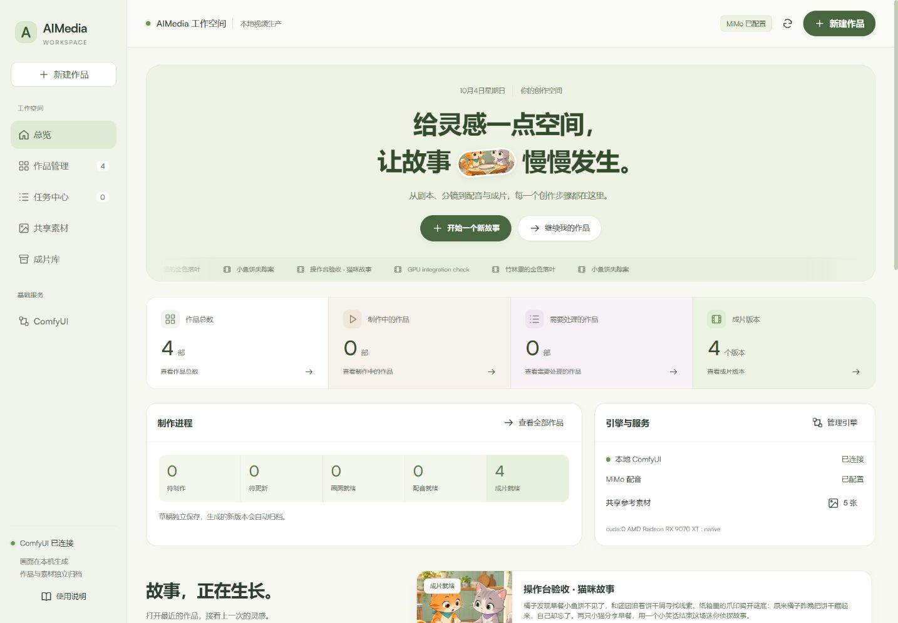
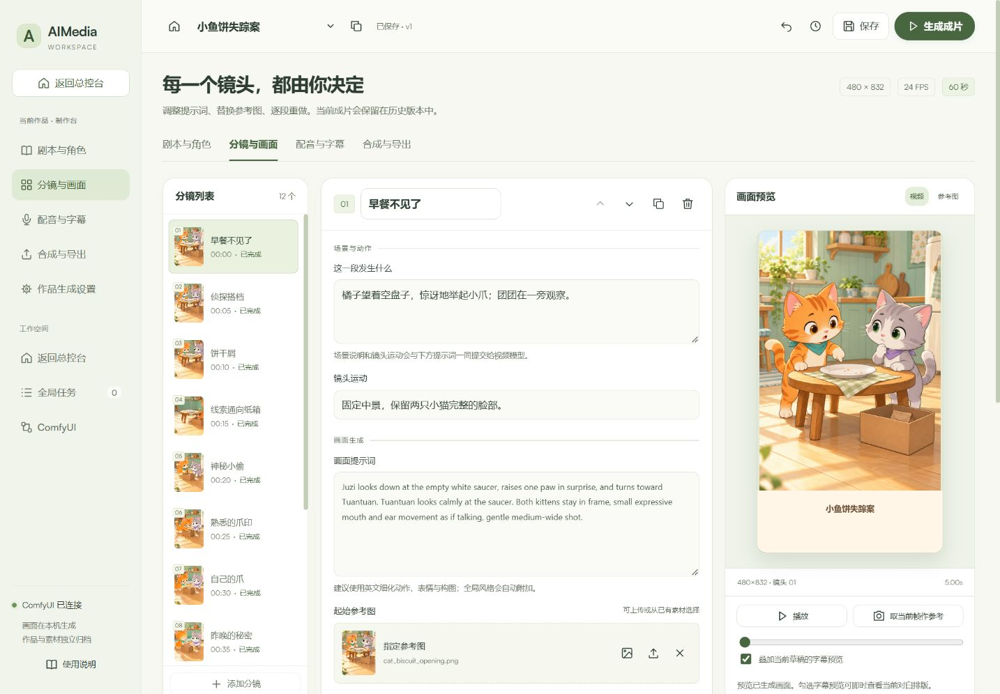
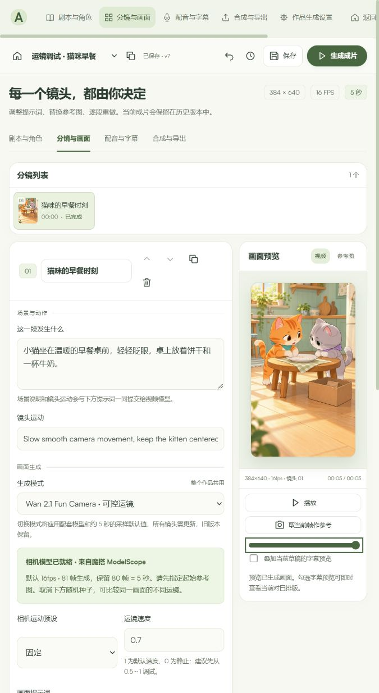

# AIMedia Studio 操作台

当前版本（2026-10-06）默认使用 H3，支持自动编剧和连续性审查，详见 [H3 自动编剧与制作](H3自动编剧与制作.md)。H3 原生对白随画面生成，修改对白会重做镜头；其原生声音不会被备用 MiMo TTS 替换。下文 Wan/Fun Camera 和独立配音的描述是早期实现记录；本机已删除两套 Wan 权重。

当前版本（2026-10-06）默认使用 H3，支持自动编剧和连续性审查，详见 [H3 自动编剧与制作](H3自动编剧与制作.md)。H3 原生对白随画面生成，修改对白会重做镜头；其原生声音不会被备用 MiMo TTS 替换。下文 Wan/Fun Camera 和独立配音的描述是早期实现记录；本机已删除两套 Wan 权重。

双击项目根目录 `start-studio.cmd`，启动本机操作台和 GPU 引擎，浏览器打开 **http://127.0.0.1:8190**。已运行的服务会直接复用。ComfyUI GPU 服务地址为 **http://127.0.0.1:8189**。

操作台复用 `ComfyUI/.venv-rocm/` 中已有的 aiohttp、PyAV、Pillow、requests，不需要安装 Node/npm、数据库或新的 Python 环境。首次启动会把已有视频批次登记为可编辑作品。

## 一级总控台与二级制作台

默认打开的是整个工作空间的总控台，不绑定某一部视频。

- **总览**：查看全部作品数量、制作中的作品、需要处理的作品、成片版本，以及制作进程、引擎状态、最近作品和生产任务。数据来自实际草稿、任务和批次文件。
- **作品管理**：按标题或梗概搜索，按制作状态筛选，按更新时间、名称或时长排序。可以预览成片，或点击进入制作台。
- **任务中心**：汇总所有作品的制作任务，显示所属作品；可以进入作品、查看结果、停止或恢复任务。
- **共享素材**：所有作品共用参考图。预览图片后，选择目标作品和具体分镜再保存，避免把素材应用到不明确的当前镜头。
- **成片库**：汇总全部作品的成片和制作版本，支持预览、下载和作为新作品继续制作。
- **ComfyUI**：整个工作空间的本地生成引擎与高级节点工作区。

进入一部作品后，显示该作品的二级制作台，包含剧本、分镜、配音、合成和作品生成设置。顶部返回作品管理，左侧返回总控台。浏览器前进、后退可在两层之间切换；离开制作台前会保存草稿。

未生成作品显示待制作；当前草稿与生成快照不同时显示待更新；异常或中断任务对应的作品显示需要处理。已生成的旧成片仍可以预览。

## 柔亮界面

总控台和作品制作台统一使用奶白、浅鼠尾草绿、淡杏色与少量浅紫色。总览展示实际作品画面，制作进程和统计集中排列；成片区支持横向浏览。输入框、素材弹窗、任务状态和预览区沿用同一套配色。

Satoshi 字体和 GSAP 动效文件位于 `services/studio/web/fonts/`、`services/studio/web/vendor/`，由本机提供，无需安装 npm，页面运行时不依赖外部 CDN。中文使用本机微软雅黑。总览包含轻量滚动动效，遵循系统“减少动态效果”设置。ComfyUI 嵌入页的原生节点画布保留其自身主题。





## 创作流程

1. 左上角选择作品。点击加号新建空白作品或使用猫咪模板；复制按钮可创建副本并复用当前素材。
2. **剧本与角色**：编辑标题、梗概、角色外观、音色、朗读风格、统一画风和负面提示词。支持导入原有剧本 JSON 或操作台导出的完整草稿。
3. **分镜与画面**：逐镜头编辑场景动作、镜头运动、画面提示词、起始参考图、种子和对白。场景动作、镜头运动、角色外观都会进入模型提示词。列表支持拖动排序，镜头可以添加、复制、删除或用上下箭头移动。
4. **配音与字幕**：试听当前镜头对白，设置音色、字幕字号、字体、底栏高度和对白起始时间。画面预览可即时叠加当前草稿的字幕。
5. **合成与导出**：生成成片会补齐需要更新的画面、配音和字幕，输出新的 MP4。可单独下载 SRT、WAV 和草稿 JSON。

修改后约 3.5 秒自动保存，也可点击保存或按 Ctrl+S。顶部时钟打开草稿历史，可恢复旧内容再保存。添加、删除、排序等结构操作提供撤销；关闭页面前尚未提交的草稿可从浏览器本地缓存恢复。

## 修改画面和降低重复生成成本

- **重做这个镜头**：只重新生成所选镜头，保留后续已完成画面。默认更换随机种子，取消勾选即可保留当前种子。
- **从这里往后重做**：重新生成当前及后续镜头，使后续画面接续新的结果。指定参考图会作为对应镜头的新起点。
- **生成成片**：自动判断画面参数、提示词、参考图、种子和连续镜头依赖，复用兼容的已完成画面。
- **合成当前草稿**：复用全部已完成画面，应用当前对白与字幕。若画面草稿已变化，会提示先生成画面。
- **只生成画面 / 只生成配音字幕**：分阶段执行，便于先确认视觉再处理对白。

仅改对白或音色不会重跑视频模型。未变化的对白复用已缓存音频；改字幕样式或标题可以直接合成。试听也会优先复用已有音频。新对白或新音色需要调用 MiMo 服务。

参考素材页支持上传 PNG、JPEG、WebP，或把已有素材用于当前镜头。预览播放器支持播放、拖动进度，并可将当前帧保存为起始参考图。这里的画面修改通过提示词和参考图重新生成实现。

## ComfyUI 集成范围

操作台通过 ComfyUI API 提交本地 Wan 2.2 TI2V 5B 或 Wan2.1 Fun Camera 1.3B 工作流，接收采样进度、获取输出并归档素材。日常操作不需要手动连接节点。

左侧 **ComfyUI** 页面嵌入原生节点编辑器，也可以独立打开。未连接时可点击启动本地 GPU 引擎。在嵌入页直接运行的自定义节点工作流仍保存到 `ComfyUI/output/`，不会自动改写操作台草稿。当前生产按钮使用已验证的 Wan 管线，尚不支持任意节点工作流与分镜参数的双向同步。

生成设置可修改分辨率、帧率、时长、采样步数、CFG、Shift、种子及本机模型文件。本机已验证的常规配置为 480×832、24fps、每段 5 秒、20 步。提高帧率会增加实际生成帧数与耗时，本版未接入 AI 补帧。各段采用相同长度，当前配音未做严格嘴型同步，梗概和分镜由用户编辑。

## Fun Camera 运镜调试

在作品的 **分镜与画面 → 生成模式** 或 **作品生成设置 → 生成模式** 选择 **Wan 2.1 Fun Camera · 可控运镜**。切换模式会应用 `config/fun_camera_video.json` 中的配套主模型、VAE、图像编码器和采样默认值：480×832、16fps、81 帧生成、80 帧合成、每段 5 秒、20 步。这是整个作品的生成模式；切换后旧画面参数不再兼容，旧生成版本仍保留。

1. 给第一个镜头选择起始参考图。后续镜头可指定自己的图片，或接续上一镜头末帧。
2. 选择 **相机运动预设**：固定、上下左右移动、推近、拉远、顺时针或逆时针旋转。
3. 设置 **运镜速度**，默认 1，可从 0.5～1 开始。该参数进入相机轨迹条件；原有“镜头运动”文字仍进入提示词。
4. 在生成设置选择 **384×640 · 运镜快速调试**，保持 16fps、5 秒，先确认构图和运动。
5. 取消 **重做时使用新的随机种子**，点击 **生成这个镜头**。改变运镜预设或速度后再重做，可在成片库中查看各次版本。固定种子便于对比，但不承诺跨机器逐像素一致。
6. 确认镜头后，可继续使用原有的配音、字幕、拼接与导出流程。

直接提高到 24fps 会增加帧数和计算量；本模型默认以 16fps 调试，操作台尚未接入补帧。模型尚未下载完成时，画面生成按钮暂停开放，配音和草稿编辑仍可使用。

模型来源：[魔搭官方 PAI 仓库](https://modelscope.cn/models/PAI/Wan2.1-Fun-V1.1-1.3B-Control-Camera)。`services/media/download_fun_camera.py` 下载三个文件，支持断点续传并校验官方 SHA256；复用已有 UMT5 FP8 文本编码器，不重复下载完整 T5。Wan 原包的图像编码器会无损转换为 ComfyUI 使用的 Transformers 权重名称，保留原始张量精度，不依赖第三方节点。

```text
ComfyUI/models/
├─ diffusion_models/wan2.1_fun_camera_v1.1_1.3B_bf16.safetensors
├─ vae/Wan2.1_VAE.pth
├─ clip_vision/wan2.1_clip_vision_h.pth          魔搭原始包，供校验和转换
├─ clip_vision/wan2.1_clip_vision_h.safetensors  工作流实际使用的图像编码器
└─ text_encoders/umt5_xxl_fp8_e4m3fn_scaled.safetensors  复用
.cache/fun-camera-download.json               下载、校验与转换进度
```

原始下载约 8.51GB，转换后的图像编码器约 2.53GB，新增磁盘占用合计约 11.04GB（十进制）。重新运行下载脚本会校验并复用完整文件。每次生成的节点图存放在 `runs/<批次>/prompts/`，执行记录存放在 `logs/`，可以在 ComfyUI 的原生工作区继续检查。

本机已验证 384×640、16fps、5 秒的推近与固定两版猫咪视频，同一种子和参考图下构图变化符合预设；20 步单段约需 4～6 分钟。验收记录见 [Fun Camera 本机接入验收](../samples/2026-10-04-fun-camera-run01.md)。



## 任务与版本

任务中心显示阶段、采样进度和日志，一次执行一个制作任务。停止只取消操作台自己的 ComfyUI 任务，已完成素材仍保留。配音请求会在当前请求结束后停止。意外中断后可继续原任务，已提交的 GPU 任务会先检查状态，避免重复提交。

每次制作创建独立批次；试音单独归档，不替换作品当前成片。成片与版本页可以预览旧版本，或将旧版本作为新作品继续修改。

```text
workspace/
├─ projects/<作品ID>/project.json       当前草稿与生成参数
│  └─ revisions/                       保存前的历史草稿
├─ assets/                             上传图片、提取的参考帧
└─ jobs/                               持久化任务状态和日志
runs/<日期时间>_studio_<批次ID>/
├─ storyboard.json / config.json       本次制作的剧本和视频参数快照
├─ tts.json / manifest.json            字幕参数和镜头执行记录
├─ clips/ / references/ / requests/    逐镜头视频、末帧参考、ComfyUI 请求
├─ audio/ / subtitles/                 配音缓存、完整音轨、SRT 与时间轴
└─ final/                              无声拼接版和带配音字幕成片
.cache/studio*.log                     本机服务启动日志
```

`workspace/` 和 `runs/` 不进入 Git；它们是持续创作的数据，迁移或备份项目时需要一并保存。原有样片目录保留。

操作台和引擎均只监听本机。MiMo 密钥由后端读取 Windows 当前用户的 `MIMO_API_KEY`，界面仅显示配置状态，草稿、导出文件和浏览器不保存密钥。
